# Hướng dẫn sử dụng git bash trên Linux


## Thực hiện push

*Thực hiện trên giao diện github hoặc SCM*

- Bước 1: Tạo 1 repository trên github bằng giao diện, sau đó copy đường link

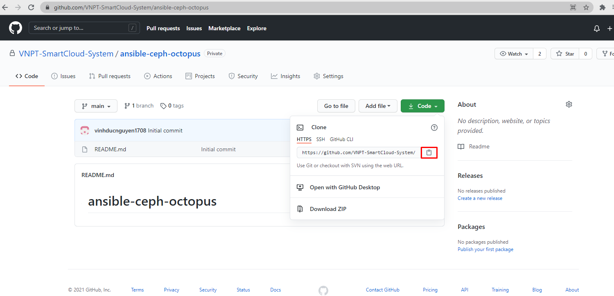

- Bước 2: Tạo branch mới 

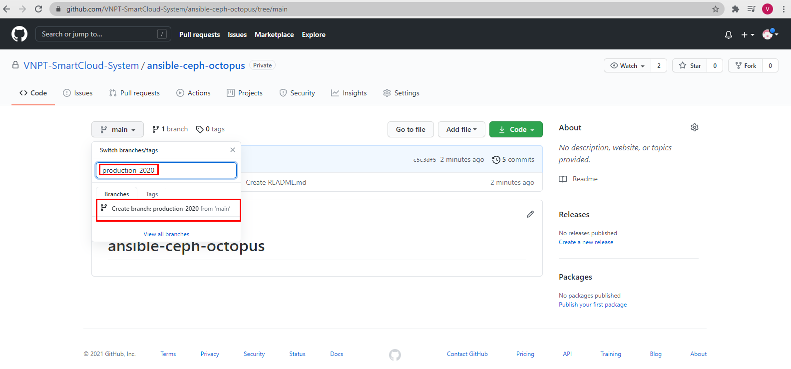

*Thực hiện trên server linux*

- Bước 1: Cài đặt git
```sh
dnf -y install git
```
 
- Bước 2: clone repository vừa tạo bằng link đã copy ở trên. Nếu là repository private sẽ phải điền username password của github.
```sh
git clone <your_url>
```

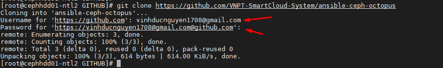

- Bước 3: Di chuyển vào thư mục đã clone về (thư mục có tên của repository), Chuyển sang nhánh cần chỉnh sửa
```sh
cd <your_directory>
git checkout <your_branch>
```
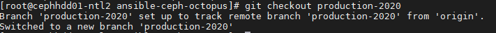

- Bước 4: **Ví dụ** ở đây thực hiện copy các file, thư mục cần đưa lên github vào thư mục đã clone về.

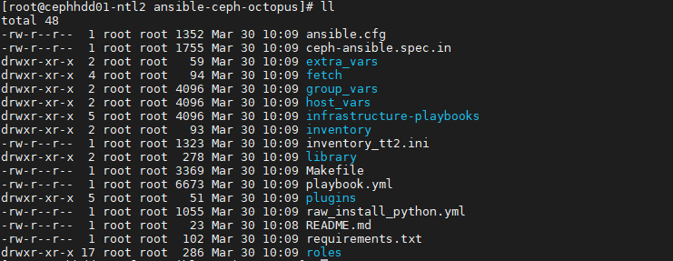

- Bước 5: Xem trạng thái của git ( những file thư mục đã bị chỉnh sửa, xóa, thêm)
```sh
git status
```

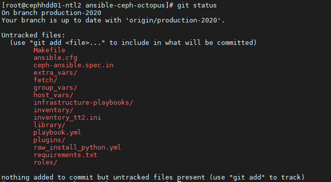

- Bước 6: Do đây là repo rỗng chưa có gì nên ta sẽ thực hiện xác thực việc add các tệp và thư mục lên repo, sau đó check lại status.
```sh
git add -A
```
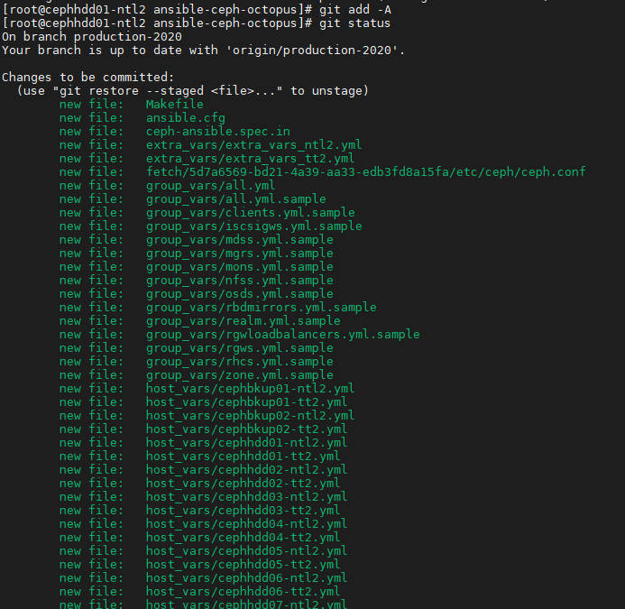

- Bước 7: Thực hiện commit thay đổi và Điền Message commit
```sh
git commit -a -m "<your_mess>"
```
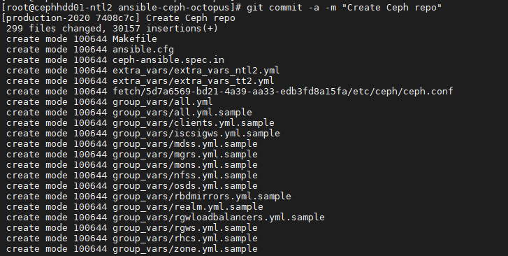

- Bước 8: Thực hiện push lên github, có thể sẽ phải điền thông tin user, pass
```sh
git push
# có thể chỉ định branch muốn push
git push origin <your_branch>
```
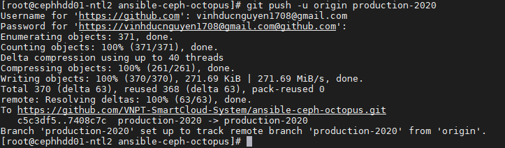

## Thực hiện merge request vào nhánh Master

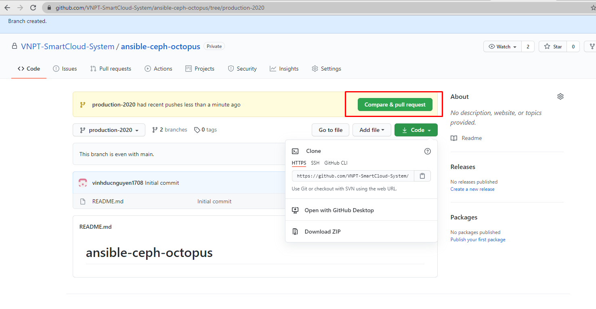

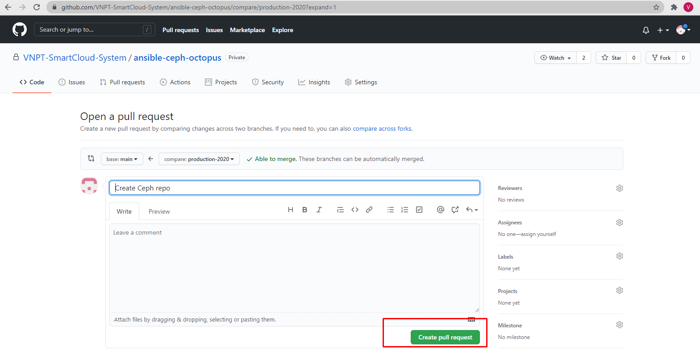

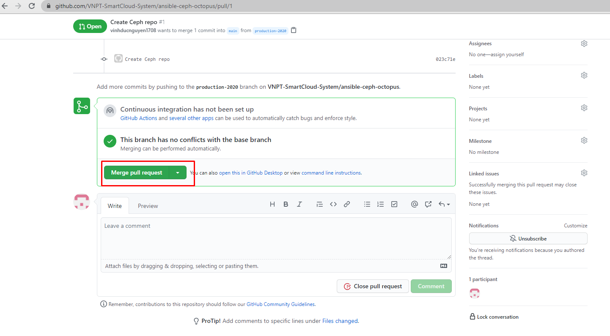

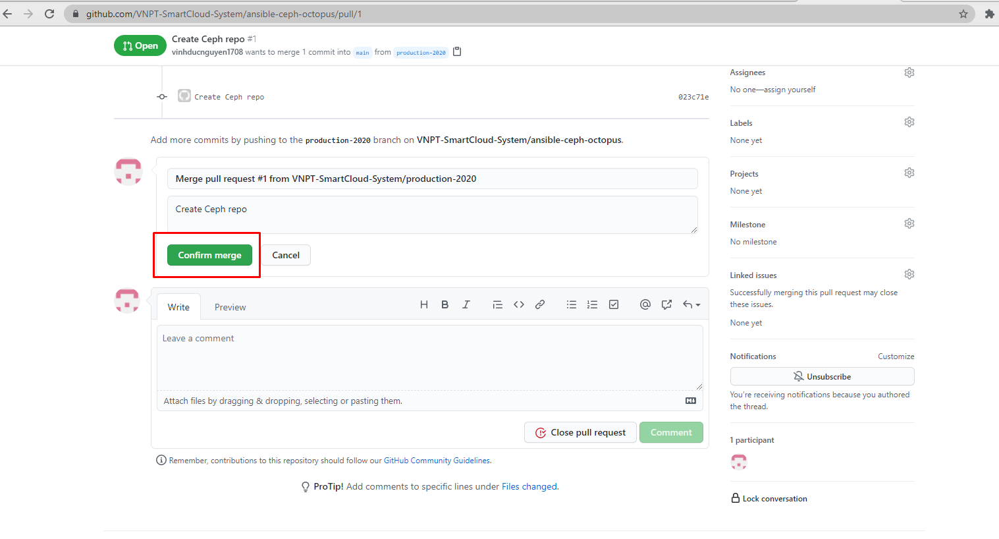